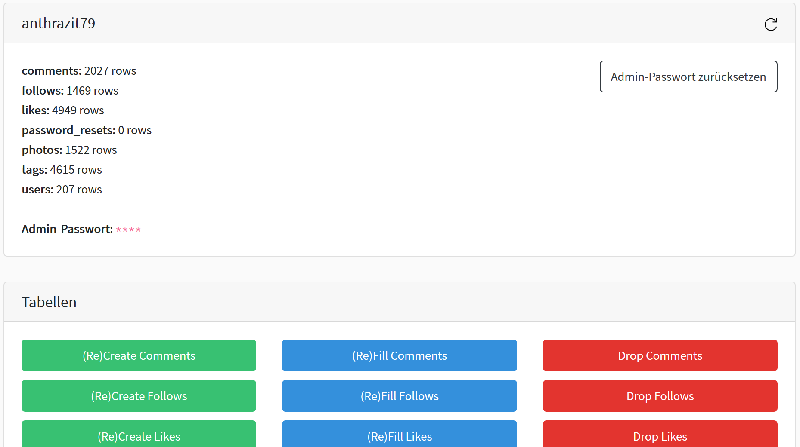
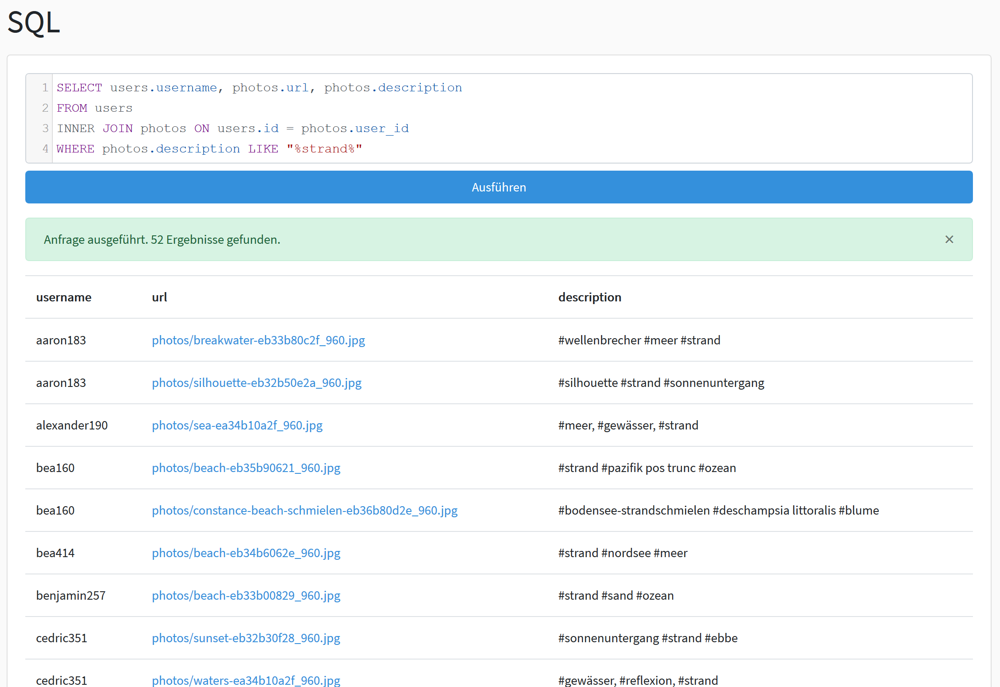

# Bedienung

## instahub.org

Die Hauptseite des Projektes ermöglicht es sich als interessierter Besucher zu informieren. Bei Interesse können hier:

* Ein Lehreraccount erstellt werden (Registrieren)
* Sich mit einem Lehreraccount angemeldet werden (Anmelden)
* Ein InstaHub erstellt werden (Erstelle deinen InstaHub)

Um sich als Lehrer zu registrieren, muss ein Account angelegt werden. Dabei ist es wichtig, dass die Emailadresse stimmt, da sonst kein Account geprüft und angelegt werden kann. 

Um einen Lehreraccount zu aktivieren, kannst du entweder gleich deine Schulmailadresse verwenden [sendest](https://wi-wissen.de/contact.php) mir einen anderen geeigneten Nachweis mit Angabe deines Benutzernamen. Das ist wichtig, dass nur volljährige Lehrer Schüler administrieren können und auf die Einhaltung der Regelungen achten.

Ein InstaHub kann nur angelegt werden, wenn dieser einem Lehrer zugeordnet wird. So ist sichergestellt, dass zum einen unter fachkundiger Anleitung ein Lernerfolg erzielt werden kann. 

Wurde einer Lehrkraft ein InstaHub zugeordnet, so muss dieser ebenfalls erst aktiviert werden. Dies kann durch die Lehrkraft selbst durchgeführt werden.


### Verwaltung der Instahubs


Nach dem erfolgreichen Login mit einem Lehrer Account wird eine List mit allen zugeordneten Hubs angezeigt. Folgende Aktionen sind möglich:

 * **Aktivieren** – Erst hierdurch wird der Instahub aktiviert.
 * **DB Admin** – siehe Verwaltung eines InstaHub
 * **Login as DBA** – Hierdurch wird der Lehrer auf den ausgewählten InstaHubweitergeleitet und loggt sich automatisch - ohne Kenntnisse desBenutzerkennwortes - als der erste DBA-Benutzer ein. Dies ist in der Regel der Schüler Account.
 * **Fill all Tables** - Um alle Funktionalitäten des Hubs zu aktivieren können hierüber alle Tabellen angelegt und mit Dummy-Daten gefüllt werden. Je nach [didaktischen Vorgehen]() kann dies sinnvoll sein.
 * **Maintenance** – Ist dieser Modus aktiviert kann nur noch lesend auf die Datenbank zugegriffen werden. Ausnahme davon ist die `Analytics`-Tabelle, welche weiterhin neue Einträge hinzufügt. Der ausschließliche Lesezugriff greift sofort wird im Hub aber erst angezeigt, wenn man sich abmeldet.
 * **Deaktivieren** – Hier kann ein InstaHub deaktiviert werden. Es ist dann kein Login mehr möglich.
 * **Delete** – Hier kann der InstaHub mitsamt der gesamten Datenbank nachBeendigung der Lerneinheit vollständig gelöscht werden. (Achtung: Hierfür ist keine Bestätigung erforderlich.). Bitte lösche nicht mehr benötigte Hubs, um Speicherplatz auf dem Server zu sparen. 


### Verwaltung eines Instahubs



Im oberen Bereich werden alle aktuell verfügbaren Tabellen mit der Anzahl aller Einträge angezeigt.

Darunter befinden sich kopiert alle Tabellen es sind jeweils folgende Aktionen möglich:

* (Re)Create - Hierdurch wird die Tabelle ohne Einträge neu angelegt.
* (Re)Fill - Hierdurch wird die Tabelle mit Dummyeinträgen neu angelegt
* Drop - Hier drüber wird die Tabelle vollständig gelöscht.

Üblicherweise ist diese Hilfestellung Für Schüler notwendig, die einen Fehler gemacht haben, nicht mitgekommen sind oder krank waren.

Sicher ist Ihnen schon aufgefallen, dass das Löschen etwa der Tabelle `Photo` kritisch sein sollte, da dadurch ja etwa die darauf aufbauende Tabelle `Like` ebenfalls gelöscht werden sollte. Dies wird hier aber absichtlich unterbunden, indem das Ausführen von Constraints ausgesetzt wird. 

Dadurch ist es möglich auch zu einem späteren Zeitpunkt die Tabelle `Photo` neu aufzubauen, ohne dass bisherige Errungenschaften in den darauf aufbauenden Tabellen vernichtet werden. Natürlich können dadurch Inkonsistenzen in der Datenbank entstehen, welche aber nicht zu einem Absturz des Systems führen werden. Ist es dennoch notwendig diese Inkonsistenzen aufzulösen, so kann dies entweder manuell geschehen oder die abhängigen Tabellen werden ebenfalls neu aufgebaut.


## *hub*.instahub.org

Wird der Hauptdomain der InstaHub Name vorangestellt, so befindet sich der Benutzer in seinem eigenen InstaHub. Jeder InstaHub funktioniert vollkommen unabhängig von allen anderen InstaHub.

Ein InstaHub ist von der Funktion her an das soziale Netzwerk Instagram angelehnt. So ist es möglich Fotos hoch zu laden und mithilfe des Hashtag-Zeichens (`#`) zu verschlagworten, mit dem `@`-Zeichen können Nutzer verlinkt werden. Ebenfalls können Fotos kommentiert und geliked werden: 


Interessanten Mitgliedern des sozialen Netzwerkes kann gefolgt werden, sodass sich ein individueller Newsfeed für jeden Benutzer bildet. Ein Benutzer besitzt eine Profilseite mit seinen Photos:


Die Besonderheit des sozialen Netzwerkes sind hier seine zwei Rollen:

* `User` - Dies sind alle regulären Benutzer des sozialen Netzwerkes. Ähnlich wie es der Schüler auf seinen sozialen Netzwerken wie etwa Facebook oder Instagram ist.
* `DBA` - hier hat der Schüler zusätzliche Rechte: Dazu zählt etwa fremde Bilder und Kommentare zu löschen. Fremde Profile zu editieren (und damit auch das vollständige Geburtsdatum und E-Mail zu sehen) und der Menüeintrag Database


### Database

Hier findet die eigentliche Besonderheit des eigenen InstaHubs statt: Es ist möglich mit SQL-Befehlen die Datenbank nach Belieben zu verändern. Ergebnisse werden dabei Übersicht präsentiert:



Da jeder Hub seine eigene Datebank hat können hierüber tatsächlich alle SQL-Befehle abgesendet werden. Auch das Löschen der eigenen `User`-Tabelle ist möglich. `SELECT`-Abfragen liefern das Ergebnis in einer Tabelle zurück. Andere Abfragen, ob sie erfolgreich ausgeführt wurden, oder welcher Fehler aufgetreten ist. Dabei wird immer der von MySQL gemeldete Fehler zurückgegeben.


## Business

Mit der Tabelle `Ads` aktiviert InstaHub die Werbeanzeigen. Alle mitgelieferten Anzeigen sind selbstverständlich frei erfunden. Werbung findet auf den einzelnen Photoseiten


oder als dritter Eintrag im Newsfeed statt:


Werbeanzeigen werden dabei personalisiert ausgeliefert. Wie diese geschieht, kann mit SQL-Kenntnissen vollständig selbst bestimmt werden:

Die Tabelle `ads` besitzt folgende Attribute, um eine Werbeanzeige zu definieren:

* `id` - fortlaufende Nummer als Primärschlüssel
* `priority` - Wenn mehrere Bedingungen zutreffen wird die Anzeige mit der niedrigsten Zahl ausgewählt (Priorität 1 ist als die höchste)
* `name` - Name der Werbeanzeige zum Wiederfinden, wird aktuell nicht verwendet
* `type` - `photo` oder `banner`. Photos werden nur im Newsfeed und Banner nur unter einzelen Photos in der Detailansicht angezeigt.
* `url` - Ziellink, auf den der Nutzergeleitet wird. Es wird empfohlen `/noad` als Adresse zu verwenden, dann kommt der Nutzer auf eine eingerichtete Fehlerseite, dass die Werbekampagne bereits ausgelaufen sei. Die Schulhomepage als Adresse ist aber ebenfalls möglich
* `img` - Anzuzeigendes Bild. Aktuell sind nur die unter Business angezeigten Werbebanner im System hinterlegt. Es ist aber auch möglich die Werbegrafik einfach als Photo hochzuladen oder einen absoluten Link auf eine Grafik im Internet zu verwenden (Beachte, dass du das nur machen darft, wenn das für den fremden Werbserverinhaber in Ordnung ist).
* `query` - SQL Ausdruck, der ermittelt, ob die Anzeige geeignet ist. Im Ergebnis des Ausdrucks wird nur das erste Attribut mit dem ersten Attributwert geprüft. Ist das Ergebnis nicht `false`, `null` oder `0`, so wird die Anzeige als geeignet gewertet. Als Platzhalter können `$user` für die User-ID des Benutzers und wenn es vom `type` `banner` ist die dazugehörige Photo-ID `$photo` verwendet werden.
* `created_at` - aktueller Zeitstempel, wird aktuell nicht verwendet
* `updated_at` - aktueller Zeitstempel, wird aktuell nicht verwendet

Hier zwei Beispiele für eine `query`:

```sql
SELECT 
	CASE gender 
		WHEN 'male' THEN true 
		ELSE false 
	END 
FROM users where id=$user
```

Dieser Befehl gibt `true` zurück, wenn das Geschlecht des aktuellen Nutzers `male` ist. Ansonsten `false`.

```sql
SELECT 
	CASE 
		WHEN device = 'desktop' THEN true 
		ELSE false 
	END 
FROM analytics
WHERE user_id=$user
ORDER BY id DESC
LIMIT 1
```

Es können beliebige Befehle geschrieben werden. Bitte beachte aber, dass der dafür gut geeignete Befehl [`WITH`](https://mariadb.com/kb/en/library/with/) erst ab MariaDB 10.2.1 und in MySQL in Version 8 eingeführt wurd. Diese Versionen sind noch nicht auf allen Servern - wie etwa dem offiziellen InstaHub.org Server.

```sql
SELECT id FROM users WHERE id=$user
```

In diesem Fall wird ja immer die User-ID zurückgegeben. Da diese größer als `0` ist, wird diese Anzeige immer als möglich betrachtet. Sie sollte daher mit einer sehr geringen Priorität (etwa `99`) als Fallback-Lösung eingerichtet werden.

Der vollständige SQL-Befehl kann etwa so aussehen:

```sql
INSERT INTO ads (priority, name, type, url, img, query, created_at, updated_at) VALUES
(1, 'default', 'photo', '/noad', 
 '/img/ad/freizeitpark.jpg', 
 'SELECT 
 	CASE 
 		WHEN device = "desktop" 
 		THEN true 
 		ELSE false 
 		END 
 FROM analytics WHERE user_id=$user 
 ORDER BY id DESC 
 LIMIT 1', 
 '2018-10-06 22:00:00', '2018-10-06 22:00:00')
```

Wichtig ist, dass der eingebettete SQL-Befehl als Zeichenkette übergeben wird. Werden Anführungszeichen verwendet dürfen diese nicht mit den umschließenden Anführungszeichen übereinstimmen. (Hier werden `""` von `''` umschlossen.)


## Werbeblocker

Kann Werbung nicht angezeigt werden, wird ein Hinweis angezeigt. In diesem Fall nutzt dein Browser einen Adblocker wie etwa [uBlock Origin](https://de.wikipedia.org/wiki/UBlock_Origin). Eine Filterung im Schulnetzwerk ist eher unwahrscheinlich, da die fiktiven Anzeigen ja vom selben Server kommen.

Bei größeren SchülerInnen kann auch die Funktion eines [Anti-Adblock Killers](https://github.com/reek/anti-adblock-killer#anti-adblock-killer--reek) besprochen werden. Dieser unterdrückte nämlich zuerst die hier [implementierte Lösung](https://stackoverflow.com/a/20505898), um die Warnanzeige zu umgehen. Diese ist so weit oben bei Google zu finden, dass der Skript einfach auf Verdacht `var canRunAds = true;` in die Webseiten injected. Daher habe ich die Variable auf einen zufälligen Namen geändert und schon klapptes es wieder. Das kann natürlich auch ausgehebelt werden, aber dafür müsste dies individuell für die Seite gemacht werden. Sehr schwer wird es, wenn ich den Variablennamen serverseitig jedes Mal neu auswürfeln würde. Dann könnte man das `div`-Element mit einer speziellen CSS-Regel ausblenden oder mit JavaScript löschen, wodurch ich auch dessen `id` ändern müsste. Jetzt müsste man das Element anhand des CSS-Pfades bzw. XPath suchen, wodurch ich die Position variieren müsste. Du erkennst wohin die Reise geht?